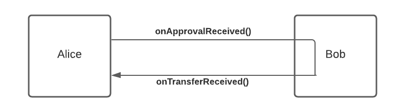
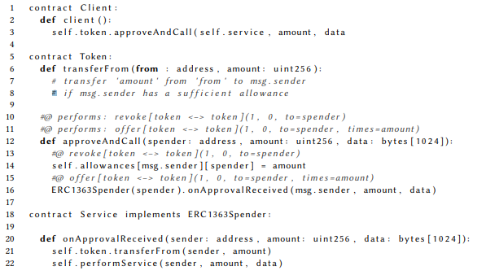

# ERC1363

## Problems ERC 1363 solves

- The ERC1363 is an ERC20 compatible token that can make a callback on the receiver contract to notify token transfers or token approvals.
- It can be used to create a token payable crowdsale, selling services for tokens, paying invoices, making subscriptions, voting systems and many other purposes.
- Basically, it wants to define a way to make an action after a transfer or an approval action in a single transaction avoiding to introduce waiting time or to pay GAS twice.




## How ERC 777 is different?

- `transferAndCall` and `transferFromAndCall` will call an `onTransferReceived` on a `ERC1363Receiver` contract.
- `approveAndCall` will call an `onApprovalReceived` on a `ERC1363Spender` contract.
- ERC-1363 tokens can be used for specific utilities in all cases that require a callback to be executed after a transfer or an approval received. ERC-1363 is also useful for avoiding token loss or token locking in contracts by verifying the recipient contract's ability to handle tokens.

```solidity
function transferAndCall(address to, uint256 value, bytes memory data) public virtual returns (bool) {
        transfer(to, value);
        _checkOnTransferReceived(_msgSender(), to, value, data);
        return true;
    }

/**
     * @dev Performs a call to `IERC1363Receiver::onTransferReceived` on a target address.
     * This will revert if the target doesn't implement the `IERC1363Receiver` interface or
     * if the target doesn't accept the token transfer or
     * if the target address is not a contract.
     *
     * @param from Address representing the previous owner of the given token amount.
     * @param to Target address that will receive the tokens.
     * @param value The amount of tokens to be transferred.
     * @param data Optional data to send along with the call.
     */
function _checkOnTransferReceived(address from, address to, uint256 value, bytes memory data) private {
    if (to.code.length == 0) {
        revert ERC1363EOAReceiver(to);
    }

    try IERC1363Receiver(to).onTransferReceived(_msgSender(), from, value, data) returns (bytes4 retval) {
        if (retval != IERC1363Receiver.onTransferReceived.selector) {
            revert ERC1363InvalidReceiver(to);
        }
    } catch (bytes memory reason) {
        if (reason.length == 0) {
            revert ERC1363InvalidReceiver(to);
        } else {
            assembly {
                revert(add(32, reason), mload(reason))
            }
        }
    }
}
```



Simplified code example showing the functionality of ERC1363 payments.

The client calls `approveAndCall` on the token contract and supplies as arguments both the service provider and the input for the requested service. The token contract stores that the service provider may take tokens from the client (in field allowances), and then invokes `onApprovalReceived` on the service provider, which re-entrantly calls `transferFrom` to take its tokens and then performs the service. This architecture intentionally uses re-entrancy to allow clients to do in one transaction what would usually require two (one for setting the allowance, one for invoking the service).

### Advantages  

1. **Extendable Functions**: It introduces `transferAndCall()` and `transferFromAndCall()` functions which allow tokens to be spent and notify a receiver contract in a single transaction.  

2. **Custom Logic Execution**: Like ERC777, ERC1363 permits the execution of custom logic after the token transfer.  

3. **Backwards Compatibility**: Ensures a broad range of application and reduces integration friction for platforms.  

4. **Solves the Reentrancy Attack Problem**: ERC1363 addresses the reentrancy attack vulnerability posed by ERC777 by implementing the execution of post-transfer logic.  

### Why ERC1363 was introduced  

1. **Security Concerns with ERC777**: Given the vulnerabilities in ERC777, there was a need for a safer standard that preserved the beneficial features.  

2. **Better Developer Experience**: Combining features from ERC20 and ERC777, while eliminating their vulnerabilities, offers developers a more robust and versatile standard.  

3. **Optimization of Transaction Processes**: With ERC1363, developers can execute more complex operations while minimizing the number of transactions, leading to a better user experience and cost savings.  
