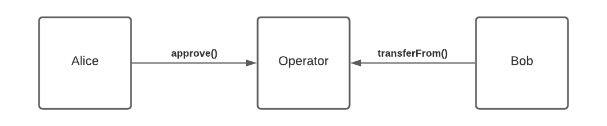
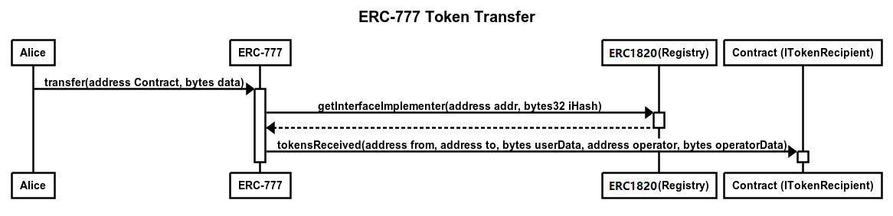
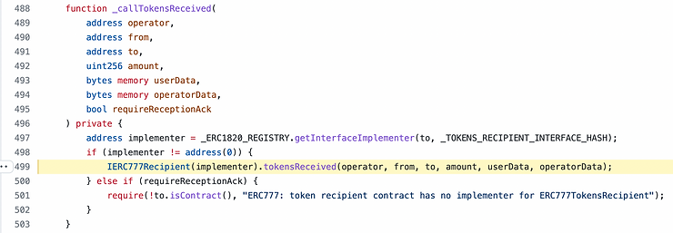
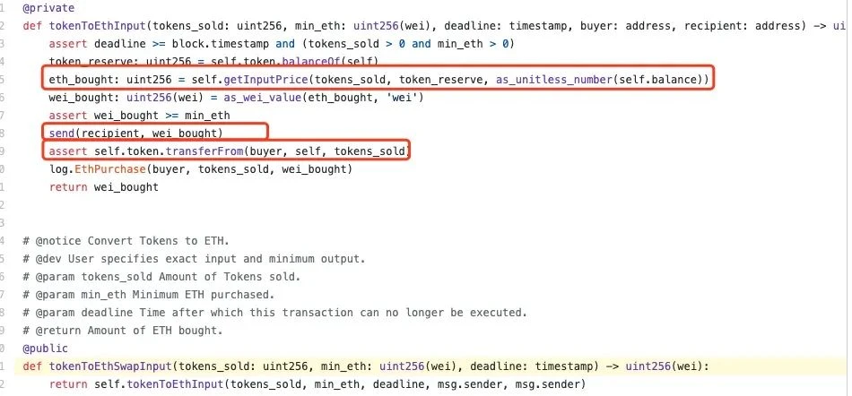
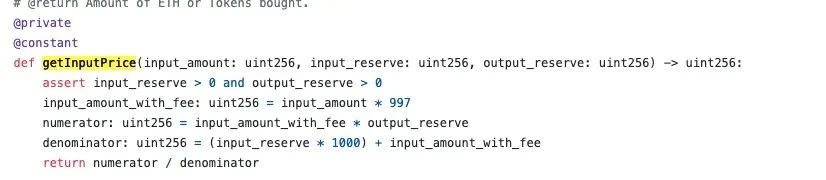
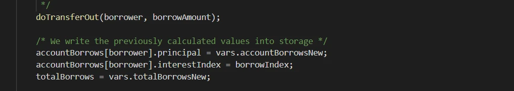
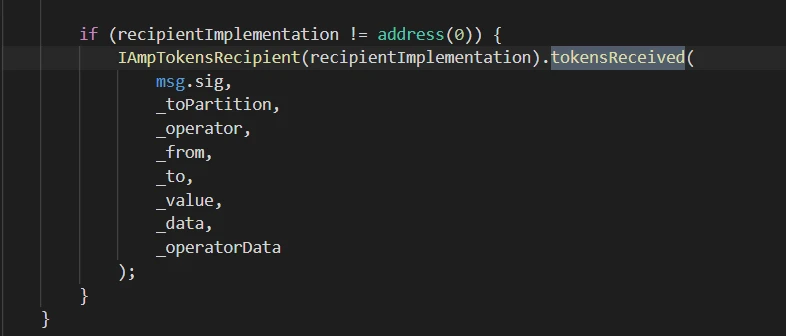

# ERC777

## Problems ERC 777 solves

- The ERC20 standard does not provide a way to record who sent how many tokens to a customized contract, and therefore, it is not possible to do further calculation in that customized contract (since it doesn't know it received ERC20 tokens).
- Also, due to the lack of a transfer notification mechanism in the ERC20 standard, many ERC20 tokens, when mistakenly transferred to a contract, cannot be retrieved, resulting in a significant number of ERC20 tokens being permanently locked for this reason.

## How ERC 777 is different?

- Uses the same philosophy as Ether in that tokens are sent with **`send(dest, value, data)`.**
- Both contracts and regular addresses can control and reject which token they send by registering a **`tokensToSend`** hook.
- Both contracts and regular addresses can control and reject which token they receive by registering a **`tokensReceived`** hook.
- The **`tokensReceived`** hook allows sending tokens to contract addresses and issuing notifications in the transaction, unlike ERC20, which requires two calls (`approve/transferFrom`) to achieve a similar effect.
- Token holders can specify or remove operator (contract) addresses, typically entities that have been verified, such as exchanges, check processors, or automated fee systems.
- Each transaction contains **`data`** and **`operatorData`**, which are bytes fields for passing information between token holders and operators.
- The **`tokensReceived`** hook function can be deployed through proxy contracts, making ERC777 compatible with ERC20 wallets.

# How Hooks work?

ERC1820 is a global contract with a unique contract address on the Ethereum blockchain, which is always **`0x1820a4B7618BdE71Dce8cdc73aAB6C95905faD24`**.

The ERC1820 contract provides two main interfaces:

1. **`setInterfaceImplementer(address _addr, bytes32 _interfaceHash, address _implementer)`**: This function is used to set which contract (**`_implementer`**) implements a specific interface (**`_interfaceHash`**, which is the keccak256 hash of the interface name) for a given address (**`_addr`**).
2. **`getInterfaceImplementer(address _addr, bytes32 _interfaceHash) external view returns (address)`**: This function is used to query which contract implements a particular interface for a specific address. It returns the address of the contract that implements the specified interface for the given address.

When using the **`send`** function to transfer tokens in ERC777, the implementation of ERC1820 comes into play. It checks if there are corresponding implementing contracts for the interfaces specified in the ERC777 standard at the sender's and receiver's addresses. ERC777 defines specific interfaces and function names as per the standard, and if implementations exist, the corresponding functions are invoked. This allows for more flexibility and extensibility in how token transfers are processed, and it enables the execution of additional logic defined by these interfaces during token transfers.

In ERC777, when using **`operatorSend`** for token transfers, there are additional rules and considerations:

1. If the token holder has registered an implementation of the ERC777TokensSender interface through ERC1820, the token contract must call its **`tokensToSend`** hook function.
2. If the recipient has registered an implementation of the ERC777TokensRecipient interface through ERC1820, the token contract must call its **`tokensReceived`** hook function.
3. If a **`tokensToSend`** hook function is present, it must be called before modifying the balance state.
4. If a **`tokensReceived`** hook function is present, it must be called after modifying the balance state.
5. When calling hook functions and triggering events, the **`data`** and **`operatorData`** must be passed as is, as the **`tokensToSend`** and **`tokensReceived`** functions may use this data to cancel the transfer (trigger a revert).

Exactly, these rules and considerations within the ERC777 standard help ensure the atomicity of ERC777 transactions and their associated hook functions.

## Security issues with ERC 777

**Reentrancy**

`tokenReceived` function handles over execution control to the contract who receives ERC777 token, thus reentrancy attack is possible.

**The attack vector with arbitrary calls**

Researchers usually think ERC777 tokens make calls to token senders and receivers. But we described above that this is a myth - senders and receivers can choose ANY address as hook receivers.

So, imagine a target smart contract that allows making arbitrary calls to any address with any data. Such functions can exist in DEX aggregators, wallets, multicall contracts.

The attack:

1. Attacker finds a function in Target that allows arbitrary calls
2. Attacker makes a Target call:
3. registy1820.setInterfaceImplementer(Target, hookHash, Attacker)
4. Now, our Attacker is an implementer for Target
5. Attacker can call with every hookHash used in major ERC777 tokens
6. Every time Target receives an ERC777 token, Attacker receives a hook call
7. The following attack is different depending on the target code:
    - Attacker can reenter when some user executes a function in the target contract
    - Attacker can just revert, so that the user’s transactions are just reverted

DEX aggregators may experience problems if they calculate that the optimal swap path lies through some DEX pair with some ERC777 token.

**Example: imBTC on Uniswap Attack (2020-04-18)**

Use Tx `0x32c83905db61047834f29385ff8ce8cb6f3d24f97e24e6101d8301619efee96e` as example

1. The attacker initially used the **`ethToTokenSwapInput`** function to exchange some ETH for imBTC through Uniswap.
2. Subsequently, the attacker used the **`tokenToEthSwapInput`** function to attempt to convert imBTC back into ETH. Uniswap first sent ETH to the attacker, and called the **`transferFrom`** function of imBTC. 
3. Since imBTC implements the ERC777 standard, this triggered the **`tokensToSend`** hook function.
4. In the **`tokensToSend`** hook function registered by the acttacker, the attacker attempted to exchange imBTC for ETH once again.

1. In Uniswap **`ethToTokenInput`** function, it used the **`getInputPrice`** function to determine the amount of ETH that the token could be exchanged for. Then, it used the **`send`** function to transfer ETH to the user and, finally, used the **`transferFrom`** function to transfer the tokens back into the contract.

1. During the attacker's initial swap of imBTC for ETH in Uniswap, Uniswap first sends ETH to the attacker, reducing the ETH reserve in Uniswap. Then, Uniswap calls the **`transferFrom`** function (note that the attacker's imBTC has not been deducted at this point).
2. In the second swap calculation, only the ETH reserve decreases, while the imBTC reserve does not increase. This results in a change in the formula's numerator during the second swap of imBTC for ETH, compared to when the **`ethToTokenSwapInput`** function is called separately. The denominator of the formula remains unchanged. This means that, compared to a regular swap, the attacker can profit slightly during the second exchange by reentrantly altering the calculation formula, making it profitable. By repeating this process, the attacker can obtain more ETH for an equivalent amount of imBTC, causing losses for Uniswap liquidity providers.

**Example: imBTC on Lendf.Me Attack (2020-04-18)**

**Example: AMP on Cream Finance Attack (2021-08-30)**

attacker flashloan contract: `0x38c40427efbaae566407e4cde2a91947df0bd22b`

attacker liquidation contrac: `0x0ec306d7634314d35139d1df4a630d829475a125`

1. First, the attacker initiated a flashloan using the contract **`0x38c4`** to borrow the initial capital of 500 ETH.
2. Attacker staked ETH to get erETH
3. Using the contract **`0x38c4`**, attacker called the **`CErc20Delegator`** contract to borrow 19,480,000 AMP tokens.
4. Then the attacker exploited a reentrancy vulnerability to continue calling the **`CEther`** contract and borrow an additional 355 ETH.
5. Attacker used `0x0ec3` contract to liquidate lending position of contract **`0x38c4`** 
6. The contract **`0x38c4`** transferred the tokens to the contract **`0x0ec3`** for redemption, resulting in the retrieval of approximately 187 ETH.
7. repay of flashloan

 Reentrancy vulnerability came from: The **`borrowFresh`** function, in the context of lending and borrowing, typically follows a sequence where it transfers the borrowed funds using the **`doTransferOut`** function first and then records the latest changes or updates. 

The **`doTransferOut`** function contains a **`transfer`** function that may use **`_callPostTransferHooks`** to callback the **`tokensReceived`** function of the recipient contract.
